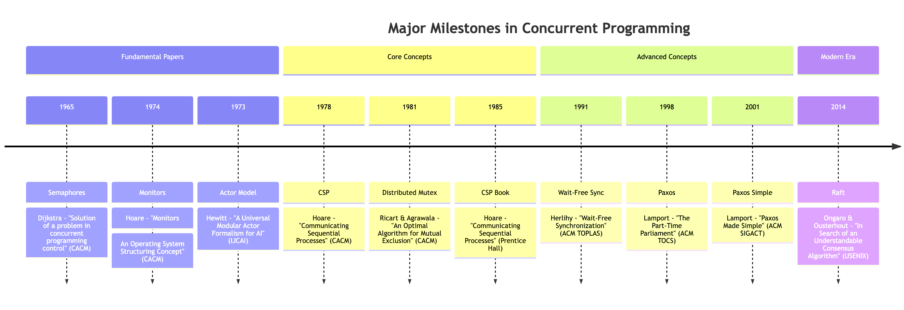
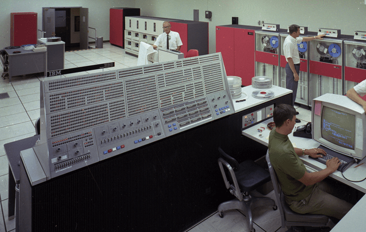

+++
title = "The origin of concurrent programming 🕰️"
date = "2025-01-13T03:37:00-03:00"
author = "Facundo J Gonzalez"
authorTwitter = "facujgg"
draft = false
tags = ["programming", "concurrency", "software-engineering", "computing", "distributed-systems", "parallel-computing", "operating-systems", "history"]
keywords = ["concurrency", "parallel computing", "asynchronous programming", "modern software", "distributed systems", "concurrent programming", "multithreading", "time-sharing", "operating systems history", "early computing"]
description = "Explore the fascinating history of concurrent programming, from early time-sharing systems to modern concurrency models. Learn how key innovations in operating systems shaped today's concurrent computing landscape."
showFullContent = false
readingTime = true
hideComments = false
+++

# The Origins of Concurrency: From Operating Systems to Modern Languages ⏳

_This article is part of a series dedicated to demystifying concurrency, breaking down its evolution from early computing to modern solutions._

## The Dawn of Concurrent Programming 🌅

The journey of concurrent programming began in the 1960s, evolving from a concept confined to operating systems into a general-purpose programming paradigm. While the initial motivation was the development of reliable operating systems, practitioners quickly recognized that the principles of concurrent programming had far broader applications. In those early days, one of the most significant challenges wasn't just implementing concurrent programs - it was finding the right way to think and talk about them. The development of precise notation and terminology would eventually revolutionize concurrent programming, but the path to get there was far from straightforward.

## Early Challenges and the Software Crisis 🚨

The first multiprogramming systems were programmed in Assembly language without any conceptual foundation, leading to a period of significant instability. The slightest programming error could cause these systems to behave erratically, making them nearly impossible to test reliably. By the late 1960s, operating systems with multiprogramming support had grown so large and unstable that their designers openly spoke of a software crisis. This crisis highlighted a fundamental truth: intuitive understanding of concurrent concepts wasn't enough - the field needed precise, formal ways to describe and implement concurrent systems.

## Pioneering Breakthroughs 💡

The landscape of concurrent programming was forever changed when Tom Kilburn and David Howarth pioneered the use of interrupts to simulate concurrent execution of multiple programs on the Atlas computer. This programming technique, which became known as multiprogramming, marked the beginning of a new era in computing. However, the real breakthrough in concurrent programming abstraction came with E. W. Dijkstra's "Cooperating Sequential Processes," which introduced semaphores and the concept of critical regions.

Dijkstra's contribution was revolutionary because he made explicit assumptions about critical regions - sections of code accessing shared resources that shouldn't be accessed simultaneously by multiple processes. His proposal of using semaphores to protect critical regions and prevent race conditions was more realistic than previous solutions, which relied on interrupt disabling or were limited to two processes on a uniprocessor system. The semaphore concept has since become a cornerstone of concurrent programming and influenced the development of other synchronization primitives like mutexes and condition variables.

## The Evolution of Operating Systems and Communication 🔄

The implementation of these theoretical advances took shape in two groundbreaking systems. Dijkstra's "THE Multiprogramming System" demonstrated the practical application of his ideas in an elegant operating system model. Meanwhile, P. Brinch Hansen's RC 4000 system introduced a revolutionary kernel that provided basic mechanisms for creating a parallel tree of processes communicating through messages. The RC 4000's message-passing system, where each communication consisted of a message exchange and response between two processes, laid the groundwork for what we now know as Remote Procedure Calls (RPC) in distributed systems.

## The Power of Precise Notation ✍️

When concurrent programming was in its infancy, developers understood the concepts intuitively. However, translating that intuitive understanding into precise programming constructs proved surprisingly difficult. The key challenge was transforming vague, intuitive ideas into concepts that could be precisely defined, consistently implemented, efficiently compiled, reliably verified, and clearly communicated.

Even though Dijkstra's "THE System" was implemented in assembly language, he recognized something crucial: the need for a higher level of abstraction to discuss concurrent programs. This insight led to the development of programming notation for parallel declarations that would influence decades of concurrent programming.

## Hoare's Contributions and Fundamental Principles 🏗️

C.A.R. Hoare's groundbreaking work on extending programming languages with abstract parallel programming features established five fundamental principles that still guide concurrent programming today:

1. **Interference Control** 🛡️: Parallel programs must maintain isolation and not interfere with each other's execution
2. **Process Separation** 🔒: Processes should maintain memory separation except through explicit communication channels
3. **Resource Management** ⚖️: Shared resource access must be carefully controlled and managed
4. **Critical Region Protection** 🔐: Code accessing shared resources needs robust protection mechanisms
5. **Conditional Critical Regions** 🎯: Systems need sophisticated mechanisms to avoid unnecessary waiting in critical regions

Hoare also introduced the concept of synchronous communication to programming languages, establishing that communication occurs when two processes explicitly name each other for input/output operations, with no automatic buffering. This concept would later influence modern languages like Go.

## The Legacy and Modern Impact 🌟

By 1986, Judy Bishop could confidently state that concurrency had firmly established itself within the realm of reliable languages. This historical development laid the foundation for modern programming languages, distributed systems, parallel computing, and current concurrency models. The evolution from early multiprogramming systems to sophisticated modern concurrency models demonstrates how the need for more reliable and efficient systems drove fundamental innovations in computing.

The lessons learned during this evolution continue to influence modern programming languages and frameworks. When you use async/await in Python or launch a goroutine in Go, you're building on principles established by these early pioneers who worked tirelessly to transform vague intuitions about concurrent programming into precise, practical tools.

## Looking Forward 🔭

The journey from assembly language and basic multiprogramming to modern concurrent programming constructs shows us that the real power lies not just in implementation, but in abstraction and notation. As we continue to face new challenges in concurrent and parallel programming, these fundamental principles remain as relevant as ever, guiding the development of new tools and techniques for managing complexity in modern software systems.
